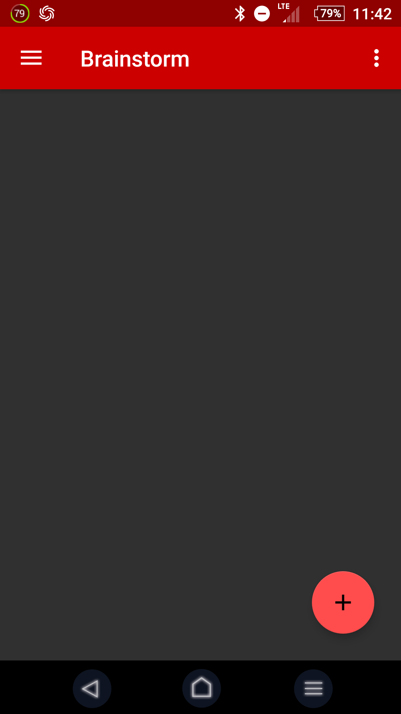
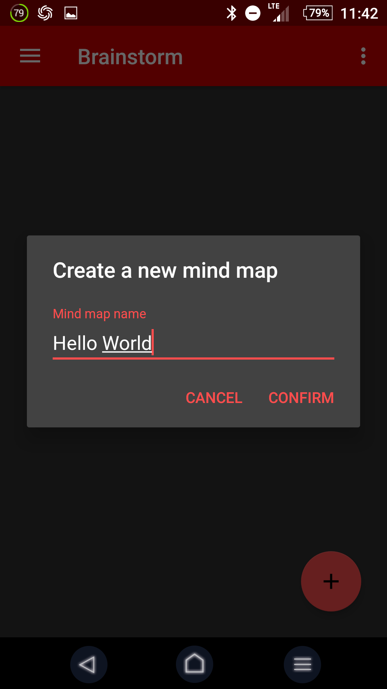

# Brainstorm

**Description:** An app ready to help you create your own mind map in an easy way on almost any device.

## Instalation
### Getting the code
**1. Clone the repository**
``` bash
git clone https://github.com/kd226/Brainstorm/
```

**2. Get the sbt in some way**
You can find some information here: [Scala on Android](scala-android.org/).

**3. Open the project and play**
It is open-source so you can look at it, modify and upgrade in any way you need. So have fun.  :bomb:  :balloon:

### Just App
Well, we could send it on Google Play but we they have too much money anyway. So you have to download the .apk file anyway.

### How to use it:
**1. Open the app**
When you open the app, you will see splash screen and after this almost blank activity like this:
{ width=50% }
Just click the plus button and you will be able to create a mind map.
{ width=50% }


## TODO:

- [x] add about section
- [ ] make the app itself workable (fix bugs)
- [ ] refactor
- [x] documentation
- [ ] some features
- [x] create some badass styles(+1)
- [ ] Choose mindmaps folder
- [ ] Upgrade forcelayout api 
	- [ ] correct distances between nodes
	- [ ] text inside the circle
	- [ ] circle colors
	- [ ] pass drawables
- [ ] Add option to have mind map and text switchable
- [ ] Add help section
- [ ] Add node colors
- [ ] Add node emojis

## FIXME:

- [ ] Text autocompletion
	- [ ] Custom input method
	- [~] Highlighting lint errors (arguable)
- [x] Parser sets mindmap name as whole file address
- [x] Refresh mind map list on resume
- [x] Automatic version
- [ ] Dividers between mind maps
- [ ] Opening side menu in map view saves?!
- [x] Side menu in map view is transparent 
- [x] Internationalize mind map deletion
- [x] Internationalize lint errors
- [ ] Drawn mind map behaves weirdly when center node moved (at least 7 child nodes)
- [ ] Ask if discarding changes when leaving unsaved mind map
- [ ] Add an exception that the mind map has to start from zero level
- [ ] choosing the size of indentation
