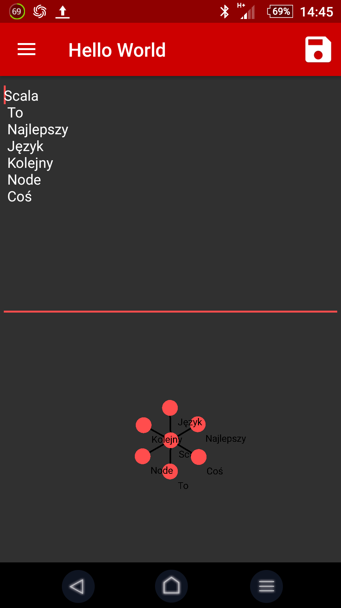
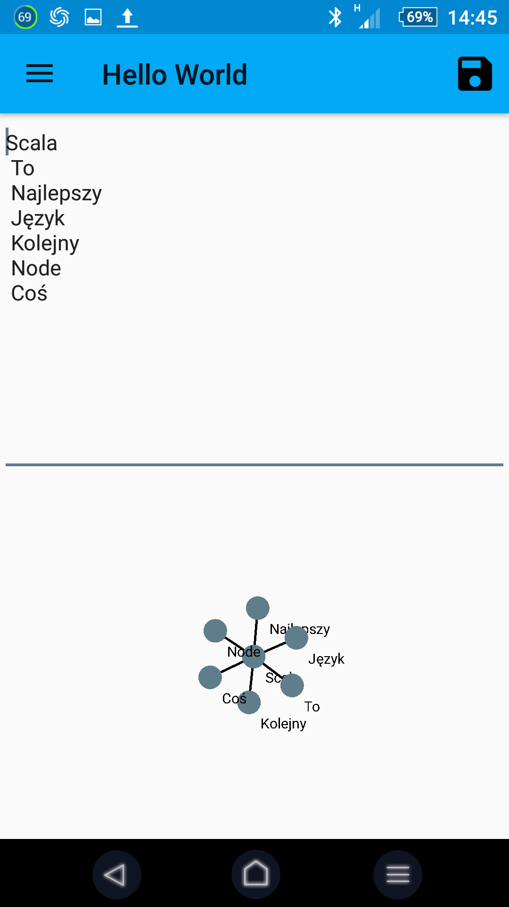
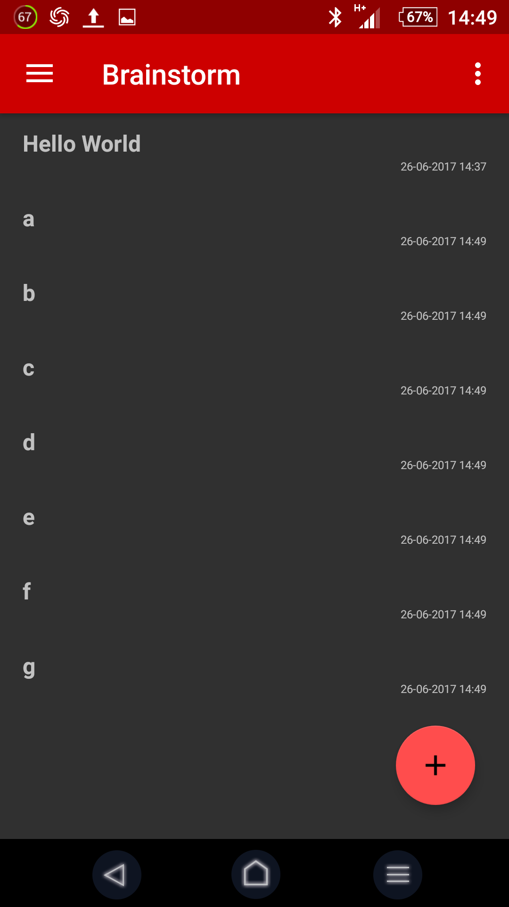
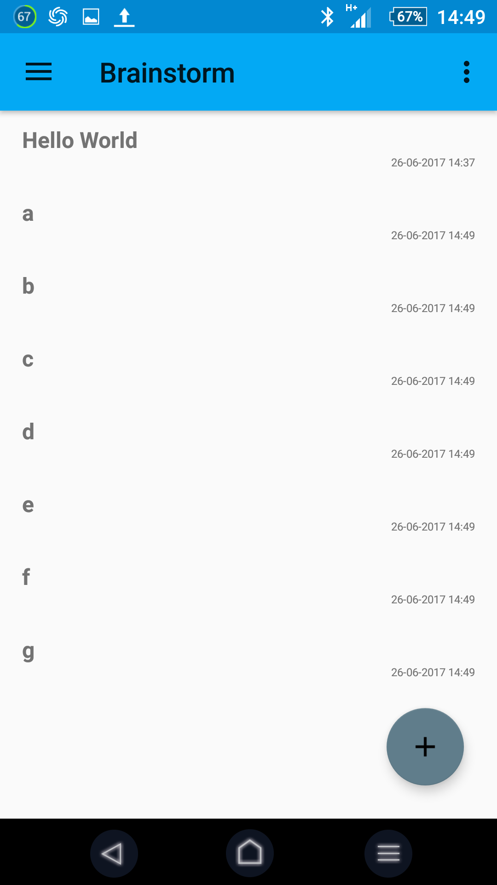
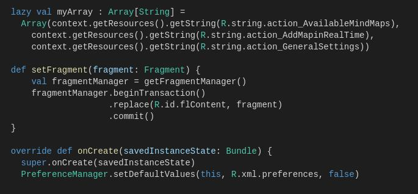
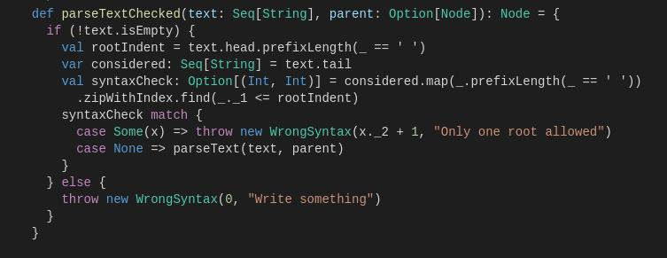
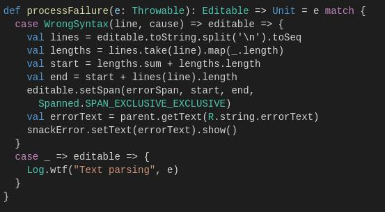
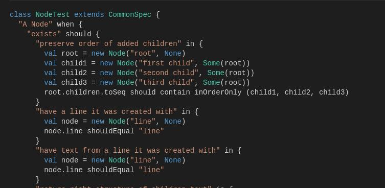

:title: Brainstorm
:skip-help: true
:css: brainstorm.css
:data-transition-duration: 800

----

Brainstorm
==========

----

:id: what_id

Co to jest?
===========

.. note::
    Mapy myśli
    
----

:id: what_id2

.. note::
    Mapy myśli
    
----

Android w Scali
===============

----

Funkcyjność
===========

----

Testy
=====

----

Użyte narzędzia i biblioteki:
=============================

* Android Studio

* Forcelayout
 
* sbt

* git

----

Live
====

Repozytorium:

https://www.github.com/kd226/Brainstorm

Apk:

http://bit.ly/2u3pQqe
